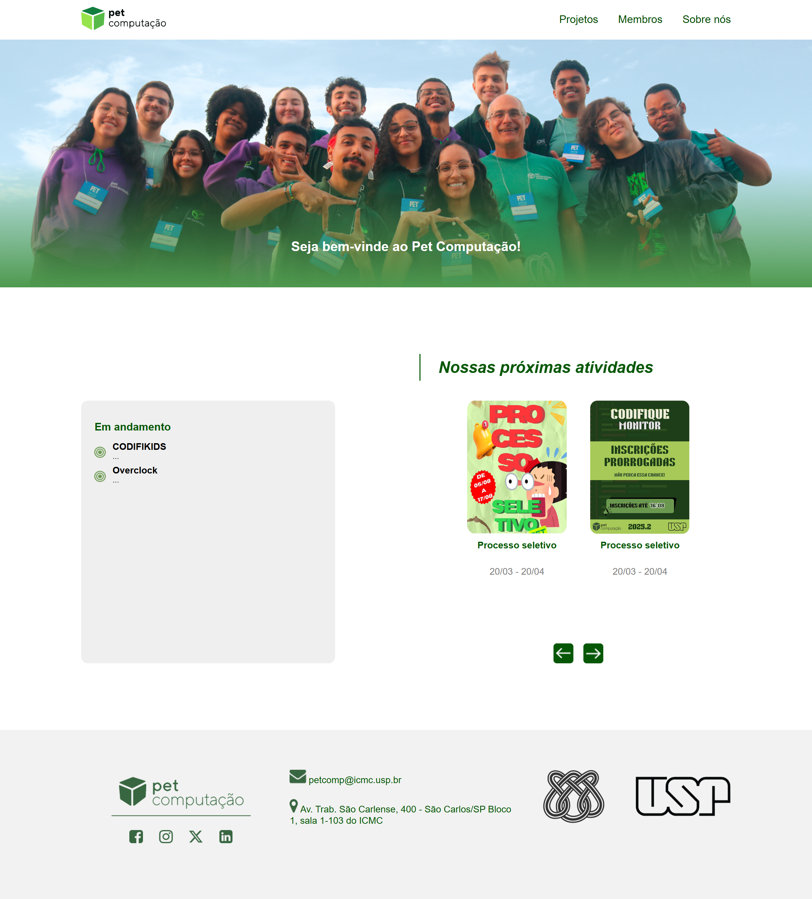
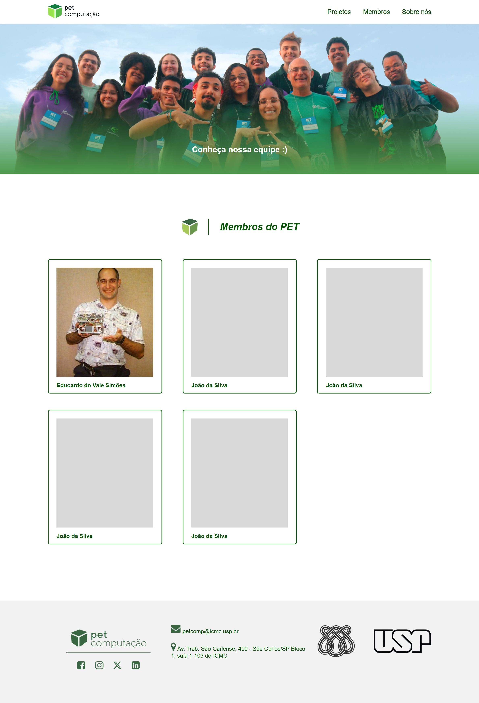
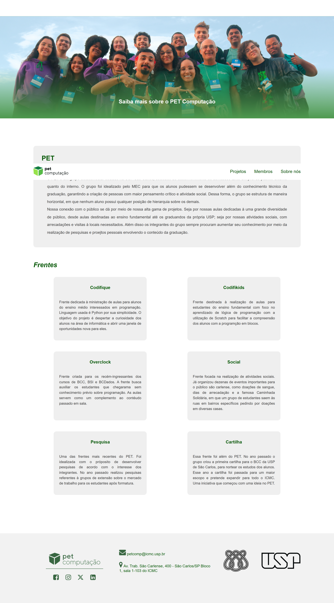

# Projeto Processo Seletivo Codelab
Site do Pet Computação  
Nome: Cecília Pignatelli de Oliveira - BCC 026
### Tecnologias utilizadas: 
- HTML
- CSS
- JavaScript

### Design
O design foi totalmente baseado no modelo do Figma disponibilizado. O estilo foi feito em CSS tentando manter maior proximidade possível com o modelo nas páginas "inicial" e "membros". Na página "sobre nós", foi feita uma disposição das informações simples pois não havia um exemplo de modelo.

### Responsividade
A responsividade das páginas do site é mínima, mas funcional. Foram feitas, de modo geral, com a propriedade flex-wrap do display flex (CSS) pois a responsividade não foi o foco principal do site. De toda maneira, para que o site esteja utilizável, a responsividade não é complexa mas mantém a funcionalidade.

### 

### Backend
Como sugerido na proposta do projeto, há alguns arquivos com informações para comporem o site, como atividades atuais e futuras. Todas as informações contidas nos arquivos JSON estão no site do modo que era a intenção: feitas com JavaScript para que sua alteração seja fácil e não necessite mudanças no HTML. Uma questão que encontrei foi: apenas utilizar os arquivos com JS com "fetch" causa um erro de CORS POLICY que não é tão simples de se resolver. Há algumas soluções possíveis para esse problema em que a funcionalidade permanece. A mais simples que encontrei foi: colocar os dados no próprio JavaScript, assim não é necessário acessar outros arquivos de origens diferentes (o que causava o erro anterior). Assim, temos todos os dados do site em variáveis no próprio código JavaScript e para modificar as informações do site é apenas necessário modificar estas variáveis.

### Imagens e Vídeos
Imagens das três páginas desenvolvidas: Início, Membros e Sobre  
  
  
  

### Site
