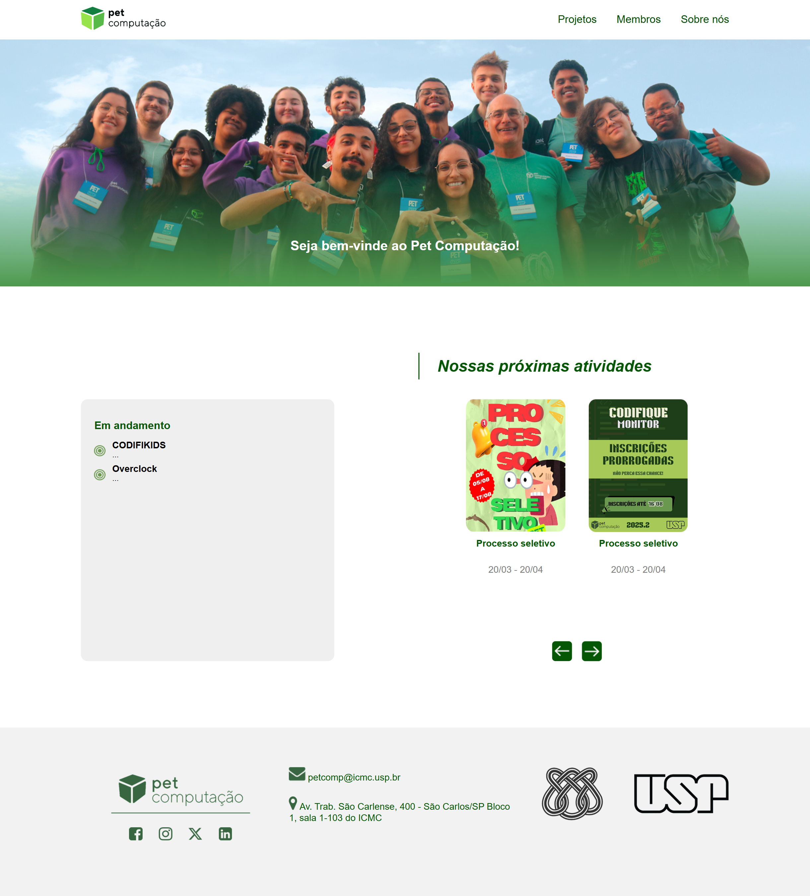
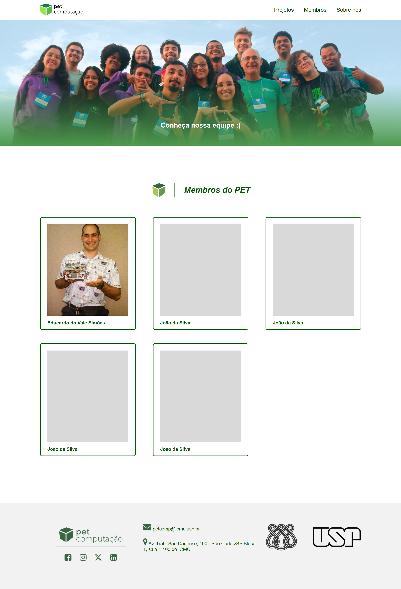
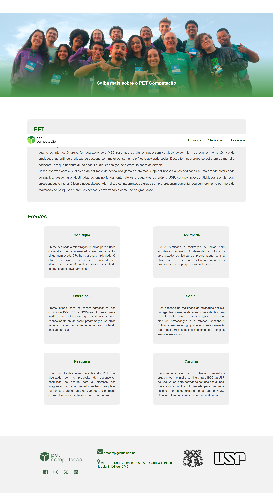

# Projeto Processo Seletivo Codelab
Site do Pet Computação  
Nome: Cecília Pignatelli de Oliveira - BCC 026
### Tecnologias utilizadas: 
- HTML
- CSS
- JavaScript
## Apresentação
O projeto escolhido para realizar foi o site do PET Computação, e eu fiz ele ao longo de um mês, em extensão, como um projeto solo. Como foi desenvolvido durante as férias, havia uma certa dificuldade de montar um grupo, mas também pela facilidade de fazê-lo sozinha, foi isso que escolhi. No projeto, foram desenvolvidas três páginas: Index, Membros e Sobre, cada uma seguindo o exemplo no Figma, com as devidas imagens, fonte e informações. A estrutura da pasta do projeto foi separada nas pastas "view", para os arquivos HTML, "public", para os arquivos JavaScript, "imagens", para as fotos e imagens presentes no site e "prints" do  site, "videos", para os videos de navegação do site (para visualização, apenas) e uma pasta "dados", com os arquivos JSON de informações. Os demais arquivos (estilo em CSS e README) são os únicos no diretório da base.

### Design
O design foi totalmente baseado no modelo do Figma disponibilizado. O estilo foi feito em CSS tentando manter maior proximidade possível com o modelo nas páginas "inicial" e "membros". Na página "sobre nós", foi feita uma disposição das informações simples pois não havia um exemplo de modelo.

### Responsividade
A responsividade das páginas do site é mínima, mas funcional. Foram feitas, de modo geral, com a propriedade flex-wrap do display flex (CSS) pois a responsividade não foi o foco principal do site. De toda maneira, para que o site esteja utilizável, a responsividade não é complexa mas mantém a funcionalidade.

### Backend
Como sugerido na proposta do projeto, há alguns arquivos com informações para comporem o site, como atividades atuais e futuras. Todas as informações contidas nos arquivos JSON estão no site do modo que era a intenção: feitas com JavaScript para que sua alteração seja fácil e não necessite mudanças no HTML. Uma questão que encontrei foi: apenas utilizar os arquivos com JS com "fetch" causa um erro de CORS POLICY que não é tão simples de se resolver. Há algumas soluções possíveis para esse problema em que a funcionalidade permanece. A mais simples que encontrei foi: colocar os dados no próprio JavaScript, assim não é necessário acessar outros arquivos de origens diferentes (o que causava o erro anterior). Assim, temos todos os dados do site em variáveis no próprio código JavaScript e para modificar as informações do site é apenas necessário modificar estas variáveis.

### Imagens e Vídeos
Imagens das três páginas desenvolvidas: Início, Membros e Sobre  
  
  
  

Videos do site (navegação entre as páginas np tamanho normal e levemente reduzido) disponíveis na página "videos".

### Site
O site está disponível para visualização por meio da tecnologia Github Pages no link: 
